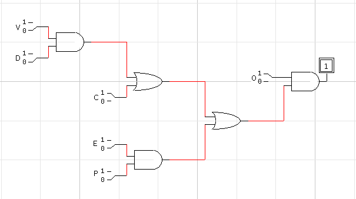
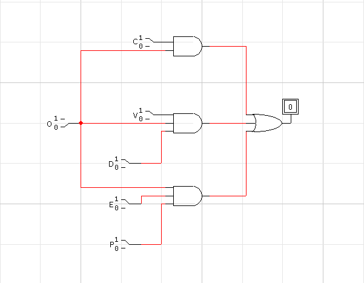

# საშინაო დავალება #01

## პირობა

პროგრამული უზრუნველყოფის საშუალებით მოახდინეთ შლაგბაუმის მარტივი ლოგიკური სქემის შედგენა ლოგიკური ელემენტების გამოყენებით და მისი რეალიზაცია ონლაინ სიმულატორზე: _თუ შლაგბაუმი ჩართულია და ადამიანი პულტის კოდს სწორად აკრეფს ან ვიდეოკამერა დააფიქსირებს მანქანის ნომერს და მას აქვს ეს ნომერი მონაცემთა ბაზაში, ან მანქანის მძღოლს ექნება სპეციალური კარტა და გადახდილი ექნება მანქანის დგომის საფასური, მაშინ გაიღება შლაგბაუმი._

### ცვლადთა დეკლარაცია და აღწერა

- $T = 1$ თუ "გაიღება შლაგბაუმი"; სხვა შემთხვევაში $T = 0$;
- $O = 1$ თუ "შლაგბაუმი ჩართულია"; სხვა შემთხვევაში $O = 0$;
- $C = 1$ თუ "ადამიანი პულტის კოდს სწორად აკრეფს"; სხვა შემთხვევაში $C = 0$;
- $V = 1$ თუ "ვიდეოკამერა დააფიქსირებს მანქანის ნომერს"; სხვა შემთხვევაში $V = 0$;
- $D = 1$ თუ "სისტემას აქვს ნომერი მონაცემთა ბაზაში"; სხვა შემთხვევაში $D = 0$;
- $E = 1$ თუ "მანქანის მძღოლს ექნება სპეციალური კარტა"; სხვა შემთხვევაში $E = 0$;
- $P = 1$ თუ "მანქანის მძღოლს გადახდილი ექნება მანქანის დგომის საფასური"; სხვა შემთხვევაში $P = 0$.

### გამოყენებული სიმბოლოები

| სიმბოლო | ლოგიკური ოპერაცია |
| ------- | ------------------ |
| $∧$     | და                 |
| $∨$     | ან                 |

### განტოლება და გამოსახულების მინიმიზაცია

გამოსახულებათა მინიმიზაციის პროცესი:

1. სრული ჩანაწერი: $T = O ∧ ((C ∨ (V ∧ D)) ∨ (E ∧ P))$;
2. გამარტივებული ჩანაწერი: $T = O ∧ (C ∨ V ∧ D ∨ E ∧ P)$;
3. კომპრესირებული გამარტივებული ჩანაწერი: $T = O (C ∨ VD ∨ EP)$;
4. გაშლილი გამარტივებული ჩანაწერი: $T = O ∧ C ∨ O ∧ V ∧ D ∨ O ∧ E ∧ P$;
5. გაშლილი კომპრესირებული გამარტივებული ჩანაწერი: $T = OC ∨ OVD ∨ OEP$.

**კომენტარი**: რეალობიდან გამომდინარე, $O$ აუცილებლად ჭეშმარიტი უნდა იყოს რომ შლაგბაუმმა მუშაობა შეძლოს. პირობის ინტერპრეტაცია სხვანაირადაც შეიძლებოდა, თუმცა რეალობასთან ყველაზე შესაბამისი ზემოაღნიშნული გამოსახულებებია და შესაბამისად მეც ზემოაღნიშნული ლოგიკური კავშირი ვარჩიე.

### ჭეშმარიტების ცხრილი

განვიხილავ $8$ შემთხვევას, ვინაიდან $2^{7}$ სხვადასხვა ვარიანტია:

| $O$ | $C$ | $V$ | $D$ | $E$ | $P$ | $T$ |
| --- | --- | --- | --- | --- | --- | --- |
| 0   | 0   | 0   | 0   | 0   | 0   | 0   |
| 0   | 0   | 1   | 0   | 1   | 1   | 0   |
| 0   | 0   | 1   | 1   | 1   | 1   | 0   |
| 0   | 1   | 1   | 1   | 1   | 1   | 0   |
| 1   | 0   | 0   | 0   | 1   | 1   | 1   |
| 1   | 0   | 1   | 1   | 0   | 0   | 1   |
| 1   | 0   | 1   | 0   | 0   | 0   | 0   |
| 1   | 1   | 0   | 0   | 0   | 0   | 1   |

### ლოგიკური წრედი

სრული ვარიანტი:

სრულ ვარიანტში განიხილება შემთხვევა, როდესაც:

| $O$ | $C$ | $V$ | $D$ | $E$ | $P$ | $T$ |
|-----|-----|-----|-----|-----|-----|-----|
| 1   | 1   | 0   | 0   | 0   | 0   | 1   |

როგორც სურათზე ჩანს, მხოლოდ $O$-ს და $C$-ს ჭეშმარიტება საკმარისია რომ $T$ გახდეს ჭეშმარიტი.

მინიმიზირებული ვარიანტი:

მინიმიზირებულ ვარიანტში განიხილება შემთხვევა, როდესაც:

| $O$ | $C$ | $V$ | $D$ | $E$ | $P$ | $T$ |
|-----|-----|-----|-----|-----|-----|-----|
| 0   | 1   | 1   | 1   | 1   | 1   | 0   |

როგორც სურათზე ჩანს, მხოლოდ $O$-ს არაჭეშმარიტობა საკმარისია რომ $T$ არ იყოს ჭეშმარიტი.
